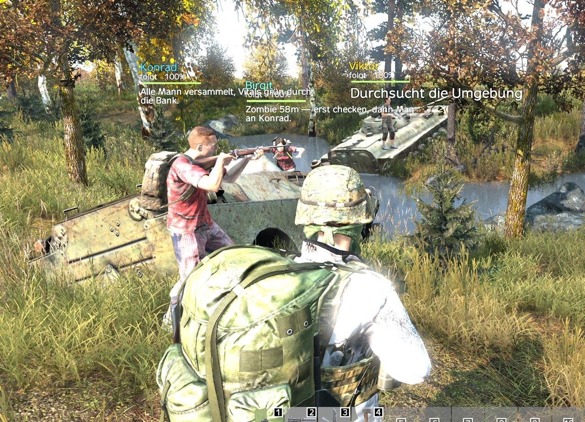

> Deutsche Fassung. English version: README.md

# dayz-ai-survivor

Ein autonomer DayZ-Survivor, gesteuert von Claude Code. Die Architektur hat drei Schichten: Reflexe macht die Expansion-AI auf dem Server (EnforceScript), Taktik macht ein lokaler Daemon, Strategie und Chat macht Claude über MCP. Aus Phase 1 (reine Motorik) ist inzwischen ein vollständiges **Mehr-Agenten-System** geworden: bis zu vier von Claude gesteuerte NPCs gleichzeitig, je mit eigenem Gedächtnis, Modell und Stimme, dazu hörbare Sprache (Discord + 3D im Spiel), schwebende Namensschilder, ein In-Game-Setup-Menü und Direktbefehle per Tastatur/Befehlsrad. Die Phasen-Historie unten dokumentiert den Weg dahin; die jüngsten Features stehen unter „v0.8" am Ende.



*Ein Trupp Claude-gesteuerter Survivor koordiniert sich im Feld — jedes schwebende Namensschild zeigt Name, aktuelle Aktion, HP-Balken und eine Live-Gedankenzeile, und sie funken einander zu.*

**▶ Im Steam Workshop:** [ISU Survivor Agent Bridge](https://steamcommunity.com/sharedfiles/filedetails/?id=3751378445) · [ISU Survivor Voice](https://steamcommunity.com/sharedfiles/filedetails/?id=3751379952) — die In-Game-Hälfte des Projekts. Du brauchst zusätzlich den Daemon (dieses Repo) und DayZ-Expansion-AI.

**Schnelltest der Motorik (Phase 1):** `python daemon\test_driver.py demo` spawnt einen NPC und schickt ihn 80 m weit. Steht am Ende `ERFOLG`, ist die Bridge in Ordnung.

## Projektlayout

```
mod\IsuSurvivor\          EnforceScript-Servermod (Bridge, Motorik, Sensorik, Chat-Hook)
daemon\bridge.py          File-Bridge-Client + Lagebeschreibungs-Formatter
daemon\test_driver.py     Manuelle Steuerung + Akzeptanztests (demo, demo2)
daemon\dayz_mcp.py        MCP-Server: Werkzeuge fuers Gehirn (observe, move_to, loot_area, clean_weapon, say, ...)
daemon\run_agent.py       Agent-Runner: Claude Code headless als Survivor-Gehirn
daemon\arena_supervisor.py Startet/stoppt die Arena-Agenten auf Menue-Befehl
daemon\orchestrator.py    Schiedsrichter/Lagezentrum ueber den Squad (Menue-Toggle)
daemon\persona_de.md      System-Prompt: wer Viktor ist und wie er denkt
daemon\smoke_mcp.py       MCP-Handshake-Test ohne Claude
agent_home\               Arbeitsverzeichnis des Gehirns (CLAUDE.md = Langzeitgedächtnis,
                          journal\ = Logbücher aller Sessions)
tools\                    Pack-, Install- und Start-Skripte (PowerShell, ASCII-only)
docs\protocol.md          JSON-Protokoll der File-Bridge
reference\                Expansion-Scripts (sparse) + Vanilla-Scripts (entpackt) als API-Referenz
```

Die Pfade der Skripte sind über Umgebungsvariablen konfigurierbar (siehe `.env.example`):

| Variable | Standard (Steam-Default) |
|---|---|
| `DAYZ_SERVER_DIR` | `C:\Program Files (x86)\Steam\steamapps\common\DayZServer` |
| `DAYZ_DIR` | `C:\Program Files (x86)\Steam\steamapps\common\DayZ` |
| `DAYZ_WORKSHOP_DIR` | `C:\Program Files (x86)\Steam\steamapps\workshop\content\221100` |
| `DAYZ_TOOLS_DIR` | `C:\Program Files (x86)\Steam\steamapps\common\DayZ Tools` |

Wer Steam auf einem anderen Laufwerk oder in einem anderen Ordner installiert hat (etwa eine eigene Steam-Bibliothek auf `D:`), setzt diese Variablen entsprechend — entweder per `setx` oder in einer `.env`-Datei im Projektordner.

## Einmalige Einrichtung

### 1. DayZ-Expansion-AI abonnieren

Die Abhängigkeitskette ist CF → Dabs Framework (DF) → Expansion-Core → Expansion-AI. CF (1559212036), DF (2545327648) und Expansion-Core (2291785308) liegen schon in deinem Workshop-Ordner. Achtung Verwechslungsgefahr: 2291785437 ist Expansion-**Vehicles**, nicht Core. Es fehlt nur **DayZ-Expansion-AI**: <https://steamcommunity.com/sharedfiles/filedetails/?id=2792982069> → Abonnieren, Steam lädt ~1 GB. Warten bis fertig.

### 2. Workshop-Mods in den Server linken

```powershell
powershell -ExecutionPolicy Bypass -File tools\install_mods_to_server.ps1
```

Legt Junctions `@CF`, `@DayZ-Expansion-Core`, `@DayZ-Expansion-AI` im Serververzeichnis an, kopiert die bikeys und die Dev-Server-Config (`serverDZ-isu.cfg`: BattlEye aus, Signaturprüfung aus, **nur für lokale Entwicklung**).

### 3. Mod packen

```powershell
powershell -ExecutionPolicy Bypass -File tools\pack_mod.ps1
```

Packt `mod\IsuSurvivor` per Addon-Builder-CLI und kopiert die PBO nach `%DAYZ_SERVER_DIR%\@IsuSurvivor\addons`. Nach jeder Code-Änderung neu ausführen plus Server-Neustart.

In-Game-Menü (`mod\IsuVoice\GUI\isu_arena_menu.layout`, Taste Einfg), Befehlsrad und Namensschilder liegen in `mod\IsuVoice`, nicht in `mod\IsuSurvivor`. Wer am Menü, am Radial oder am Schilder-Layout etwas ändert, packt mit `powershell -ExecutionPolicy Bypass -File tools\pack_mod.ps1 -ModName IsuVoice` (Ziel `%DAYZ_SERVER_DIR%\@IsuVoice\addons`) und startet den Server neu.

**GUI-Fallback** (falls die CLI-Flags der installierten Addon-Builder-Version abweichen): Steam → Bibliothek → Werkzeuge → DayZ Tools → Addon Builder.
Quelle `<repo>\mod\IsuSurvivor`, Ziel `%DAYZ_SERVER_DIR%\@IsuSurvivor\addons`, unter Options bei "List of files to copy directly" eintragen: `*.c;*.cpp;*.json;*.xml`. Der Addon-Prefix kommt aus der Datei `$PBOPREFIX$` (IsuSurvivor).

### 4. Server starten

```powershell
powershell -ExecutionPolicy Bypass -File tools\start_server.ps1
```

Erster Start dauert 1 bis 3 Minuten, Expansion generiert dabei seine Settings und Loadouts unter `profiles\ExpansionMod\`. Sobald der Server steht, taucht `profiles\IsuSurvivor\state.json` auf und wird sekündlich aktualisiert. Das ist das Lebenszeichen der Bridge.

## Spiel starten und beenden (Doppelklick)

```
start_game.bat     Dev-Server + Supervisor + DayZ-Client starten (Karte wählen, NPCs im Spiel hinzufügen)
close_game.bat     alles sauber herunterfahren (schont die Server-Persistenz)
```

`start_game.bat` bringt Server, Supervisor und Client hoch; die NPCs startest du danach IM SPIEL über das Setup-Menü (Taste Einfg). Einzelne Bausteine lassen sich für Power-User auch direkt über die PowerShell-Skripte in `tools\` fahren (z. B. `tools\start_server.ps1`, `tools\start_arena.ps1` für das CLI-Arena-Menü, `tools\start_all.ps1` für den Ein-Fenster-Start).

## Der Akzeptanztest

```powershell
python daemon\test_driver.py demo
```

Ablauf: Bridge-Check (steigt `seq`?) → `ping` → `spawn` bei (4525, 2470) → `move_to` (4605, 2470) mit Live-Distanzanzeige. Einzelbefehle gehen auch:

```powershell
python daemon\test_driver.py state              # Zustand hübsch ausgeben
python daemon\test_driver.py watch              # Live-Dashboard (Strg+C beendet)
python daemon\test_driver.py spawn --x 4525 --z 2470
python daemon\test_driver.py move --x 4700 --z 2500
python daemon\test_driver.py despawn
```

Koordinaten sind Map-Koordinaten (x = West-Ost, z = Süd-Nord), wie auf iZurvive ablesbar. `y` weglassen, die Mod ermittelt die Bodenhöhe selbst.

## Zuschauen mit dem Client

```powershell
powershell -ExecutionPolicy Bypass -File tools\start_client.ps1
```

Startet DayZ über den BattlEye-Launcher (`DayZ_BE.exe`) mit den Workshop-Mods plus `@IsuVoice`. BattlEye muss mitgeladen werden, sonst kickt der Server beim Join (auch wenn der Dev-Server `BattlEye = 0` hat, ein ohne BE gestarteter Client wird abgewiesen). Der BE-Launcher zeigt kurz ein eigenes Fenster, das ist normal. Notausgang für den reinen BE=0-Dev-Server: `-NoBE` startet direkt `DayZ_x64.exe` ohne BattlEye. Deine `@IsuSurvivor`-Mod brauchen Clients **nicht** (sie läuft als `-servermod`). In der Nähe des NPCs in den Direct-Chat schreiben und danach `state` aufrufen: die Nachricht muss unter `chat` auftauchen. Damit ist auch der Chat-Empfang verifiziert.

## Troubleshooting

| Symptom | Ursache / Fix |
|---|---|
| `state.json` erscheint nie | Compile-Fehler: `profiles\*.RPT` durchsuchen nach `IsuSurvivor` oder `Compile error`. `Print`-Ausgaben der Bridge stehen in `profiles\script_*.log` |
| `commands.json` bleibt liegen | Mod nicht geladen → `-servermod=@IsuSurvivor` im Start-Skript prüfen, PBO im `addons`-Ordner? |
| Server startet nicht | Ladereihenfolge: CF → DF → Expansion-Core → Expansion-AI (macht `start_server.ps1` korrekt). Meldung "requires addon 'X'" heißt immer: die Mod, die X enthält, fehlt in `-mod` |
| `spawn` → `failed: CreateObject lieferte keine eAIBase` | Expansion-AI fehlt in `-mod` oder Workshop-Download unvollständig |
| NPC spawnt nackt | Normal beim allerersten Start, bevor `profiles\ExpansionMod\Loadouts\HumanLoadout.json` generiert wurde. Server einmal durchstarten |
| NPC läuft nicht los | RPT prüfen; falls `npc hat keine eAIGroup` in `state.errors`: siehe "Beim ersten Lauf verifizieren" unten |
| `move_to` → `failed: 45s ohne Fortschritt` | Ziel unerreichbar (Wasser, Gebäude, Zaun) oder Pathfinding-Ecke. Anderes Ziel testen |
| Fremde AI spawnen rund um Spieler | Expansion generiert beim ersten Start 34 Default-Patrols in `mpmissions\...\expansion\settings\AIPatrolSettings.json`. Auf dem Dev-Server deaktiviert (`"Enabled": 0`, Top-Level). Achtung: Expansion legt die Datei bei einem Missions-Wipe neu an |
| Client stürzt beim Join ab (ACCESS_VIOLATION oder Heap-Beschädigung, `file: intro`) | Wechselnde Memory-Corruption-Signaturen bei stabilem Server = beschädigte Client-Installation. Reihenfolge: (1) Steam-Dateiprüfung (`steam://validate/221100`), (2) `Documents\DayZ\DayZ.cfg` umbenennen (Video-Settings-Reset), (3) Client ohne `-connect` starten und per Direct Connect 127.0.0.1:2302 joinen. Hinweis: "von BattlEye gekickt" fühlt sich gleich an, aber das Server-ADM-Log zeigt den echten Grund, bei `BattlEye = 0` kickt BE nie |

## Verifikationsstand (Phase 1 + 2 bestanden am 2026-06-10)

`demo` (Phase 1): spawn → move_to 80 m in 25 s → done. `demo2` (Phase 2): Apple spawnen → pickup (hinlaufen + aufnehmen) → eat → Magenvolumen steigt. Kampftest: `zombie` + `engage` → NPC läuft hin, eAI-Kampfsystem übernimmt, "Ziel eliminiert". Verifiziert sind damit: Spawn-Rezept, Auto-eAIGroup, Waypoint-API, File-Bridge beidseitig, `eAI_TakeItemToInventory`, `PlayerBase.Consume` samt Verdauung (StomachMdfr läuft im eAI-ModifiersManager), Inventar-Snapshot, `engage`-Kampfschleife. Implementiert, aber noch nicht einzeln durchgespielt: `drink`, `flee`, `adopt_nearest`, `teleport_player` (gleiche Mechanik wie die getesteten Pfade).

**Wichtigster Befund des ersten Laufs, der Dormant-Zustand:** Expansion-AI legt AI ohne Spieler in Sichtweite schlafen (`eAIState_Dormant`, `DisableSimulation`), und der Aufwach-Guard reagiert erst ab zwei Gruppen-Wegpunkten. Ein einzelnes `move_to` weckte den NPC also nie. Fix in [IsuEAIPatches.c](mod/IsuSurvivor/scripts/4_World/IsuSurvivor/IsuEAIPatches.c): `modded class eAIState_Dormant` nimmt ausschließlich den registrierten Agent-NPC vom Schlafmodus aus, alle anderen AI behalten das Performance-Feature.

Noch offen (braucht einen verbundenen Client): **Chat-Param-Reihenfolge.** Angenommen ist `ChatMessageEventParams` = Param4<int, string, string, string> (Kanal, Absender, Text). Stimmt die Zuordnung nicht, in `IsuMissionServer.c` die Indizes tauschen.

## Phase-2-Kommandos (Kurzreferenz)

```powershell
python daemon\test_driver.py demo2                  # Akzeptanztest Loot + Essen
python daemon\test_driver.py spawn-item --item Apple
python daemon\test_driver.py pickup --item Apple
python daemon\test_driver.py eat                    # auch: drink, equip, flee, adopt
python daemon\test_driver.py zombie                 # Infizierten 25 m voraus spawnen
python daemon\test_driver.py engage                 # hinlaufen + kämpfen bis Ziel tot
python daemon\test_driver.py tp                     # Spieler zum NPC teleportieren
```

Volle Parameter- und Statusreferenz: [docs/protocol.md](docs/protocol.md).

## Phase 3: das Gehirn (Claude Code headless)

```powershell
python -m pip install mcp           # einmalig (MCP-SDK)
# Nicht-lateinische NPC-Bildschirmtexte (CJK/Arabisch/Hindi/Kyrillisch) auf ASCII
# latinisieren, weil der Stock-DayZ-Font sie nicht zeichnet (daemon/transliterate.py):
python -m pip install Unidecode pypinyin korean-romanizer indic-transliteration pykakasi
python daemon\smoke_mcp.py          # MCP-Server-Test ohne Claude
python daemon\run_agent.py --once "Lagebeurteilung, dann handle nach Prioritaeten."
python daemon\run_agent.py          # Dauerbetrieb (Strg+C beendet sauber)
```

Der Runner startet Claude Code headless (node.exe + cli.js direkt, stream-json, persistente Session) mit `daemon\persona_de.md` als System-Prompt und dem MCP-Server `dayz` als Werkzeugkasten. Claude führt seinen Tool-Loop selbst aus, der Runner weckt ihn nur: bei Chat-Nachrichten, neu auftauchenden Spielern, Infizierten unter 15 m, Schaden, kritischen Vitalwerten, beim Tod (mit automatischem Respawn und Erinnerungs-Erhalt) und sonst per Routine-Tick.

Wichtige Schalter: `--model` (Default sonnet), `--idle` Sekunden zwischen Routine-Ticks (Default 180), `--max-turns` als Sicherheitsdeckel, `--mission` für den ersten Weckruf. Der Runner teleportiert den verbundenen Spieler automatisch zum NPC (sofort oder sobald er joint); `--no-tp` schaltet das ab (für die Arena mit mehreren Runnern wichtig).

**Kosten:** Der End-to-End-Test lag bei ~0,17 USD pro Zug (Sonnet, inkl. Tool-Loop). Im Dauerbetrieb skaliert das mit `--idle`: 180 s heißt schlimmstenfalls ~20 Züge/Stunde. Für lange Läufe `--idle 300` oder mehr wählen.

Viktors Langzeitgedächtnis liegt in `agent_home\CLAUDE.md` und wird von ihm selbst gepflegt; jede Session schreibt ein Logbuch nach `agent_home\journal\`. Konsolen-Hinweis: Bei `?` statt Umlauten vorher `chcp 65001` ausführen, das Journal-File ist immer korrektes UTF-8.

## Phase 4: Viktor spricht und folgt

`say` läuft über den **Expansion-Chat** und wird **an alle Spieler global** zugestellt, damit die verstreute NPC-Konversation überall im Chat mitlesbar ist. Ist der Discord-Voice-Bot verbunden, sprechen die NPCs **nur per Stimme** und der In-Game-Chat bleibt aus (sonst stünde jede Zeile doppelt da, gesprochen und getippt); ohne Discord ist der Chat der Fallback. Gesteuert wird das über eine `discord_active.flag`, die der Bot beim Betreten des Sprachkanals setzt. Jede Aussage landet per Loopback in den Chat-Ringen der Nachbarn, damit die Mit-NPCs den Gesprächsverlauf kennen. `follow` ist ein echter Gruppenbeitritt: der NPC läuft dem Spieler in eAI-Formation hinterher, bis er selbst losgeht oder `unfollow` kommt.

**Chat-Zustellung:** `ChatMP` (vanilla) stellt in aktuellen DayZ-Versionen nicht zuverlässig zu (Bohemia-Ticket T150586), daher läuft `say` produktiv über `ExpansionGlobalChatModule` (Expansion-Chat ist ohnehin Dependency). Das ist der live genutzte Pfad; eine Analyse liegt in `reference\...\Chat\`.

Kosten-Hinweis: Claude-Modelle ohne Präfix (im Menü als `(Max-Plan)` markiert) zählen die headless-Züge gegen die Plan-Limits statt API-Dollar, die angezeigten USD im Journal sind dann nur der Gegenwert. Die `api/`-Modelle laufen dagegen über den echten Anthropic-API-Key und kosten pro Token echtes Geld, hier ist die USD-Anzeige der reale Rechnungsbetrag.

## Autonomes Looten: die Taktik-Schicht

[daemon/tactics.py](daemon/tactics.py) gibt dem NPC Urteilsvermögen: Waffen-Tier-Liste (SVD über AKM über Mosin über Pistolen), Magazin-Heuristik (Feuerwaffe zählt nur mit passendem Magazin, sonst Nahkampf), Medizin/Nahrung/Werkzeug-Erkennung, Schrott bleibt liegen. Das Gehirn ruft `loot_area(max_items)` auf, Python erledigt die Schleife aus Scannen, Priorisieren, Hinlaufen, Einsammeln und rüstet am Ende die beste Waffe aus. Die Mod liefert dafür nur die dummen Primitive (`pickup`, `equip`, Item-Sicht bis 40 m).

Manuell testbar: `python daemon\test_driver.py lootscore` (Bewertung der sichtbaren Items), `loot --max 6` (Sammellauf), `python daemon\tactics.py equip`. Hinweis: Die eAI hat zusätzlich eine eigene native Looting-Routine, die nahe Waffen/Munition selbstständig aufnimmt, die beiden Systeme ergänzen sich.

## Fahrzeug-Regel und Inventar-Persistenz (v0.4)

**Fahrzeuge:** Der NPC steigt nie eigenmächtig aus, um zu kämpfen. Drei Ebenen: (1) Sitzt er in einem Fahrzeug mit menschlichem Fahrer, tritt die Bridge automatisch dessen Gruppe bei, damit greift die native eAI-Logik "Mitfahrer bleiben sitzen". (2) Bewegungs-/Kampfbefehle (`move_to`, `flee`, `engage`, `pickup`) sind im Fahrzeug gesperrt; gewollter Ausstieg nur über `vehicle_exit`. (3) Als Gürtel unterdrückt ein 4_World-Patch (`eAIState_GetOutVehicle`) jeden nicht autorisierten Ausstieg. Steigt der Fahrer aus, folgt der NPC wie ein normaler Mitfahrer. `state.npc.in_vehicle` macht den Zustand fürs Gehirn sichtbar, der Runner meldet Ein-/Ausstieg als Ereignis.

**Inventar-Persistenz:** Der Runner sichert alle ~10 s einen Inventar-Snapshot (`agent_home\last_inventory.json`). Nach Tod oder Server-Restart spawnt er den neuen Körper nackt (`FreshSpawnLoadout`) und stellt das Inventar sortiert wieder her (Kleidung → Waffen → Munition → Rest, plus Retry nach dem Hand-Equip). Was nicht passt, geht ehrlich verloren und steht im Journal. `--no-restore` schaltet ab, `--restore-only` ist das Ops-Werkzeug für manuelle Wiederherstellung. `adopt_nearest` übernimmt nur noch echte Survivor (keine Trader-/Quest-NPCs) und nur, wenn der Körper innerhalb 200 m vom Lager liegt — sonst spawnt der Agent nach einem Server-Neustart frisch am Lager statt an einer zufälligen, kilometerweit entfernten Leiche.

## Lernen: Gedächtnis, Taktiken, Rezepte, Leichen-Loot (v0.6)

Der Survivor lernt auf drei Wegen, alle dauerhaft:

1. **Taktiken und Lektionen** schreibt das Gehirn selbst in `agent_home\CLAUDE.md` (sein Langzeitgedächtnis, wird bei jedem Start geladen). Die Persona verpflichtet ihn, Spieler-Tipps zu bestätigen, zu notieren und anzuwenden, sag ihm im Spiel "loote die Zombie-Leichen, da findet man gute Sachen", und er merkt es sich über Sessions hinweg.
2. **Rezepte:** `learn_recipe` speichert von Spielern erklärte Rezepte nach `agent_home\learned_recipes.json` ("2 Bretter + 4 Nägel = Kiste"), `recipes()` zeigt sie als [GELERNT], `craft` baut sie. Materialangaben sind Classnames.
3. **Leichen- und Behälter-Loot als Fähigkeit:** Tote Infizierte und Spieler erscheinen als `kind=corpse`, und alles am Boden mit Innenleben (Rucksäcke, Kleidung mit Inhalt, Kisten) trägt in observe den Marker `[enthält N]`. `loot_corpse` räumt die nächste Leiche aus, `loot_container` jeden Behälter mit Inhalt (optional mit Classname-Filter). Hinweis: Per Testbefehl gespawnte Zombies sind immer leer (keine Central-Economy-Zuteilung), echte Welt-Zombies tragen Loot.

## Hörbare Stimme: @IsuVoice

Echtes VON-Voice ist eine Engine-Grenze (kein Script-API, kein Audio-Streaming an Clients). Stattdessen: Sprachzeilen-Bibliothek. [voice/phrases.json](voice/phrases.json) definiert die Zeilen (33 Stück, Viktor-Ton), [voice/generate_voice.py](voice/generate_voice.py) erzeugt daraus per ElevenLabs die Oggs und die komplette `@IsuVoice`-Config samt SoundSets. Der Server triggert sie per RPC, der Client-Receiver spielt sie 3D an der NPC-Position (80 m hörbar). Das Gehirn hat dafür `voice_lines()` (Katalog) und `say_voice(phrase_id)`.

**Echte Stimmen aktivieren** (aktuell sind stille Platzhalter verbaut):

```powershell
$env:ELEVENLABS_API_KEY = "dein-key"
python voice\generate_voice.py --list-voices    # Stimme aussuchen
python voice\generate_voice.py --force          # TTS generieren (Default-Stimme: Daniel)
powershell -ExecutionPolicy Bypass -File tools\pack_mod.ps1 -ModName IsuVoice
# Server neu starten
```

`@IsuVoice` muss auf Client UND Server geladen sein (start_server.ps1 und start_client.ps1 sind angepasst; der Client lädt die Mod direkt aus dem Serververzeichnis).

### Discord-Voice-Brücke

**Komplette Einrichtungs-Anleitung (deutsch, mit Fehlerbildern): [docs/discord_bot_setup.md](docs/discord_bot_setup.md)**

Mit gesetztem `DISCORD_BOT_TOKEN` startet `run_agent.py` zusätzlich [discord_voice.py](daemon/discord_voice.py): Der Bot betritt den Sprachkanal (Default "DayZ", via `ISU_DISCORD_CHANNEL` änderbar) und spricht alles, was Viktor sagt. Katalog-Phrasen kommen als fertige Oggs (gleiche Stimme wie im Spiel), freie `say`-Texte per ElevenLabs-Live-TTS. Transportweg: `say`/`say_voice` schreiben in `agent_home\voice_outbox.jsonl`, der Bot spielt sequenziell ab.

Einmaliges Setup (nur der Serverbesitzer kann das): discord.com/developers → New Application → Bot → Token kopieren → OAuth2 URL Generator mit Scope `bot` und Permissions `Connect` + `Speak` → die URL öffnen und den Bot auf den eigenen Server einladen. Wichtig: Bots können normale Einladungslinks (discord.gg/...) nicht benutzen, nur diesen OAuth-Weg. Danach `setx DISCORD_BOT_TOKEN "..."` setzen (gilt erst im NEUEN Terminal!).

**Viktor hört auch zu, derzeit über dein lokales Mikrofon:** Discord erzwingt seit März 2026 DAVE-E2EE auf Voice-Kanälen, Bots können seitdem zwar weiter senden, aber das Nutzer-Audio nicht mehr entschlüsseln (ökosystemweites Problem, siehe discord-ext-voice-recv Issue #38). Deshalb startet `run_agent.py` zusätzlich [mic_listener.py](daemon/mic_listener.py): Er nimmt dein Standard-Mikrofon, kalibriert den Rauschteppich, schneidet Äußerungen an Sprechpausen, transkribiert per ElevenLabs Scribe und weckt das Gehirn mit "FUNK von dem Spieler: ...". Abschaltbar mit `--no-mic`, Name via `ISU_MIC_NAME`, Schwelle via `ISU_MIC_THRESHOLD`, Log in `agent_home\journal\mic_listener.log`. Der Discord-Empfangscode bleibt aktiv und übernimmt automatisch wieder, sobald voice_recv DAVE beherrscht. Viktor antwortet über `say`: Spiel-Chat plus hörbar im Discord-Funk (Senden funktioniert trotz DAVE).

## Die Modell-Arena (v0.7)

Vier Survivor, vier Claude-Modelle, vier Stimmen, ein Server. Der normale Weg ist das **Setup-Menü im Spiel** (Taste Einfg): dort Agenten, Modelle, Rollen und Gesinnung wählen und starten. Für die Kommandozeile gibt es zusätzlich das Skript:

```
powershell -ExecutionPolicy Bypass -File tools\start_arena.ps1            (Menü: Agenten wählen, Gesinnung n/f)
powershell -ExecutionPolicy Bypass -File tools\start_arena.ps1 alle n     (alle vier, neutral)
powershell -ExecutionPolicy Bypass -File tools\start_arena.ps1 viktor,igor f
```

**Das Roster** ([arena/agents.json](arena/agents.json)): vier Slots mit Defaults — Viktor (Sonnet, Jäger), Birgit (Haiku, Sanitäterin), Igor (Opus, Bauer), Konrad (Fable, Ex-Militär). Name und Rolle sind pro Slot im In-Game-Menü (Einfg) frei wählbar; die Rollen-Presets liegen in `daemon/characters/` (jaeger, bauer, sanitaeter, exmilitaer, kampfmaschine — namens-agnostisch mit `{NAME}`-Platzhalter). Jeder Slot hat eigenes Gedächtnis (`agent_homes/<id>/CLAUDE.md`), eigene Stimme und eigenes Journal-Fenster.

**Fremde Modelle (OpenAI, Google, Grok, lokal):** Der Modell-Button im Einfg-Menü kennt neben den Claude-Modellen auch `openai/gpt-4o-mini`, `openai/gpt-4.1-mini`, `google/gemini-3.5-flash`, `google/gemini-3.1-flash-lite`, `xai/grok-4.3` und `local/gemma-4-E4B-it`. Claude Code bleibt immer der Motor; nur die API wird per `ANTHROPIC_BASE_URL` umgebogen (`run_agent.resolve_backend`). Cloud-Modelle laufen über den [claude-code-router](https://github.com/musistudio/claude-code-router) (Port 3456, Keys: `OPENAI_API_KEY`, `GEMINI_API_KEY`, `XAI_API_KEY` — echtes API-Geld, nicht der Max-Plan!), Gemma 4 E4B läuft gratis auf der eigenen GPU über llama-server (Port 8080, Build ≥ b8641 wegen der Gemma-4-Tool-Call-Fixes). Der Supervisor startet beide Dienste automatisch, wenn ein Agent sie braucht ([start_router.ps1](tools/start_router.ps1), [start_llama_gemma.ps1](tools/start_llama_gemma.ps1) — der erste Gemma-Start lädt einmalig ~5 GB). Die USD-Anzeige im Journal stimmt nur für Claude-Modelle; Tokens werden für alle gezählt.

**OpenAI-Besonderheiten (Stand 2026-06-16):** Es laufen `gpt-4o-mini`/`gpt-4.1-mini`, NICHT die GPT-5-Reasoning-Modelle — der Router (v2.0.0) übersetzt deren `max_completion_tokens` nicht und reicht ein `reasoning`-Feld durch, das OpenAI mit `400` ablehnt. Darum (a) schaltet `resolve_backend` für die Router-Backends Claude Codes Thinking ab (`MAX_THINKING_TOKENS=0`, sonst entsteht das `reasoning`-Feld), und (b) deckelt der built-in `maxtoken`-Transformer in der Router-Config OpenAI auf 16000 Tokens (gpt-4o-mini erlaubt max. 16384, CC sendet sonst 32000). Grok/Gemini brauchen das nicht. **Neuen OpenAI-Key immer per `tools\set_api_keys.ps1` setzen** — ein bloßes `setx` aktualisiert die schon existierende `~/.claude-code-router/config.json` NICHT.

**Claude über die echte API (`api/`):** Neben dem Max-Plan-CLI-Login (Claude-Modelle ohne Präfix) kennt der Modell-Button im Einfg-Menü jetzt den `api/`-Präfix als eigene Einträge: `api/sonnet`, `api/opus` und `api/haiku` (volle Modell-IDs werden unverändert durchgereicht). Diese Züge laufen über deinen echten `ANTHROPIC_API_KEY` mit Abrechnung pro Token, nicht über den Max-Plan. Die Kurznamen mappt `ANTHROPIC_API_ALIASES` in `run_agent.resolve_backend` auf die vollen Modell-IDs (`sonnet` → `claude-sonnet-4-6`, `opus` → `claude-opus-4-8`, `haiku` → `claude-haiku-4-5-20251001`). Anders als bei den Router- und llama-Backends, wo `ANTHROPIC_API_KEY` aus der Subprozess-Umgebung gestrippt wird, bleibt der Key hier bewusst erhalten, genau das erzwingt die echte API statt des Max-Plan-Logins; zusätzlich biegt `ANTHROPIC_BASE_URL` fest auf `https://api.anthropic.com`. Voraussetzung ist ein gesetzter Key (`setx ANTHROPIC_API_KEY sk-ant-...`); fehlt er, schreibt das Journal eine Warnung und Claude Code fällt auf den Max-Plan-Login zurück oder scheitert. Ein lokaler Dienst ist hier nicht nötig (anders als Router auf Port 3456 oder llama-server auf Port 8080).

**Wie es zusammenspielt:** Die Mod führt eine Bridge-Instanz pro Agent (`state_<id>.json`/`commands_<id>.json`, neue Slots automatisch erkannt). Die NPCs **hören einander** in 60 m (`say` landet in den Chat-Ringen der Nachbarn) und **erkennen einander namentlich** in der Umgebungssicht, echte Gespräche zwischen den Modellen inklusive, mit Persona-Regel gegen Endlos-Dialoge. Dein Mikro läuft einmal zentral über den **Voice-Router**: Namensansprache ("Igor, ...") erreicht genau den Genannten, ohne Namen antwortet der Agent, der dir im Spiel am nächsten steht. Gesprochen wird über den einen Discord-Bot **sequenziell** aus einer Warteschlange, jeder mit seiner eigenen ElevenLabs-Stimme, kein Durcheinander.

**Gesinnung:** neutral = alle Zivilisten (friedliche Koexistenz). Feindlich = **Battle-Royale**, jeder gegen jeden inklusive Spieler (Details im Abschnitt „Battle-Royale-Modus" unten); beobachte besser per VPP-Spectate.

Danach: Basebuilding-Vollausbau. Plan: Memory `project_dayz_ai_survivor.md`.

## In-Game-Steuerung, Namensschilder, Waffen-Wartung (v0.8)

**Setup-Menü (Taste Einfg):** Komplett im Spiel konfigurierbar, auf Englisch und knapp gehalten. Modell, Rolle, Idle-Takt, Zug-Limit und die drei Direkttasten klappen als echte Dropdown-Listen auf: ein Klick aufs Feld öffnet darunter ein Panel mit den Optionen als gestapelte Buttons (head-Button + dynamisch erzeugte Item-Buttons, Muster wie DayZs eigenes Aktionsmenü), die Tastenliste steht zweispaltig. Gesinnung, Spawn-Modus und Zielmodus sind Toggle-Buttons, ein Klick schaltet um. Das **Zug-Limit** (`6 turns`, `10 turns`, `15 turns`, `OFF (unlimited)`; Default 10) bleibt der wichtigste Kosten-Hebel: `OFF` heißt unbegrenzte Runden pro Aufwachen und damit teuer. Idle-Takt steht auf 60/120/180/300s (Default 120s). Gesinnung schaltet zwischen `Neutral (co-op)` und `Hostile (battle royale)`, der Start-Button warnt entsprechend (`START (neutral)` vs. `START: HOSTILE (BR)`). Spawn-Modus wählt `Separate (scatter + rally)` oder `Group (tight squad)`, Zielmodus `Aimed NPC` oder `All NPCs`. Das Modell-Dropdown deckt die Claude-Stufen (haiku/sonnet/opus im Max-Plan und als `api/`-Variante), `openai/`, `google/`, `xai/` und `local/gemma-4-E4B-it` ab, das Rollen-Dropdown die fünf Personas (Hunter, Farmer, Medic, Ex-military, Fighter).

Einfache Toggle-Buttons bleiben: pro Slot An/Aus, Mikrofon und Comic-Chat (Sprechblasen über den Köpfen der NPCs, client-seitig). Der Name wird je Slot frei in ein Eingabefeld getippt (verbotene Zeichen `|`, `:`, `"` werden beim Lesen entfernt, leer fällt auf den Default-Namen zurück), der Camp-Button setzt den Lagerpunkt auf die eigene Position. Das Layout liegt in zwei beschrifteten Spalten, ROUND (Mode, Idle, Turn limit, Spawn, Camp) und CONTROLS (Stop key, Go-to key, Radial key, Target, Mic/radio, Comic), die vier Squad-Zeilen sitzen oben mit Name, Modell, Rolle.

Tasten-Kollision ist abgesichert: eine schon belegte Taste springt automatisch auf den nächsten freien Eintrag aus der Numpad-Liste (`ResolveFreeKey`), damit Stopp, Geh und Radial nie auf dieselbe Taste fallen. Andernfalls würde der Radial-Zweig in `OnKeyPress` die anderen beiden stumm überdecken. Defaults: Stopp `Num 5`, Geh `Num 0`, Radial `Num ,`. Die Statuszeile spiegelt die Supervisor-Antwort, eingefärbt nach Schlüsselwort (LAEUFT grün, FEHLER/ABGEBROCHEN rot, WARTE/STARTE/STOPPE gelb).

**Direktbefehle im Spiel:** Das **Befehlsrad** ist ein rundes Rad: ein `radial8`-Ring (`gui/textures/radial8.edds`) als Backdrop, fünf Befehls-Chips kreisförmig darauf, und im Zentrum steht das Ziel (`Ziel: <Name>`). Ein heller Selector folgt der Maus und hebt den anvisierten Chip hervor (der Slice dreht per `SetRotation` auf den Chip-Winkel), Linksklick führt aus. Die Befehle: Folge mir / Bleib stehen / Komm zu mir / Loote hier / Greif an (intern `follow` / `halt` / `comehere`→`goto` / `loot` / `engage`). Frei belegbare Numpad-Tasten für Stopp, Geh-dorthin und das Rad bleiben (Pos1/Ende gehören dem VPP-Adminpanel, daher Numpad). Der gewählte Befehl wirkt über `IsuNpcCommand.SendTargeted` auf den beim Öffnen anvisierten NPC; war keiner anvisiert, fällt das Rad serverseitig auf den nächsten NPC zurück.

**Schwebende Namensschilder:** Über jedem Agenten-Kopf ein Schild in Identitätsfarbe mit Name, Aktion, HP-Balken und einer Gedanken-Zeile (aktuelle Absicht), client-seitig projiziert. Stirbt ein NPC, wandert das Schild beim Respawn zum neuen Körper, statt an der Leiche zu kleben (der Server funkt dafür ein Remove-Signal mit der NetworkID der Leiche).

**Spawn am Lager:** Beim Start und beim Respawn erscheinen die Agenten am Lagerpunkt — getrennt (±14 m) oder als enge Gruppe (±2 m, Menü-Schalter). Verhindert das frühere Verstreuen über die ganze Karte.

**Reaktionsfreudige NPCs:** Lange Aktionen (move_to, looten) blockieren das Gehirn nicht mehr minutenlang — sie melden sich nach ~35 s zurück und brechen ab, sobald du funkst. Der NPC läuft serverseitig weiter; das Gehirn beendet den Zug und prüft beim nächsten Aufwachen die neue Lage. Das hält die NPCs ansprechbar und spart Tokens.

**Waffen-Wartung:** NPC-Waffen werden beim Equippen und beim Spawn auf neuwertig gesetzt und eine Ladehemmung gelöst — gelootete, beschädigte Waffen klemmen sonst und kosten den NPC im Zombie-Nahkampf das Leben. `clean_weapon` repariert die Waffe in der Hand zusätzlich explizit (verbraucht ein WeaponCleaningKit, falls vorhanden).

**Freund/Feind:** Begleiter-Agenten und der menschliche Spieler sind immer Freund (Friendly-Fire-Schutz), aber **jeder fremde NPC gilt als potenzieller Feind** — ein ziviler Begleiter würde sonst Banditen und ambiente Survivor für harmlos halten und passiv erschossen werden. Einzige Ausnahme: Trader/Markt-NPCs (sonst aggern deren Guards die Gruppe). Greift nur im Neutral-Modus; im Hostile-Modus ist es Battle-Royale (jeder Agent und der Spieler ist Ziel, siehe v1.0 unten).

**Mehrere Karten + Ein-Klick-Neustart:** [start_game.ps1](tools/start_game.ps1) wählt Chernarus, Livonia (Enoch) oder Sakhal, setzt das Server-Mission-Template, den Karten-Lagerpunkt und ein Karten-Briefing für die Modelle (damit sie wissen, wo sie sind). `close_game.bat` fährt Server, Supervisor und Client sauber herunter (persistenz-schonend, **kein Hard-Kill** — der Server darf nur über `tools\stop_server.ps1` ohne `/F` beendet werden, sonst geht die Persistenz verloren), `start_game.bat` startet alles neu und deployt frisch gepackte PBOs aus `build\` automatisch.

## Der Orchestrator: Schiedsrichter ueber den Squad (v0.9)

Bis v0.8 laufen die vier NPCs voellig unabhaengig: jeder ein eigenes Modell, eigenes Gedaechtnis, eigene Entscheidung. Genau das macht die Arena zum **Modell-Benchmark** - vier Modelle loesen dieselbe Lage unter gleichen Bedingungen, und man sieht die Unterschiede direkt. Der Orchestrator legt eine zweite Schicht darueber, **ohne diesen Vergleich zu zerstoeren**.

Im Setup-Menue (Taste Einfg) gibt es dafuer den Toggle **Orchestr. ON/OFF** (Default OFF).

- **AUS**: alles bleibt wie gehabt, vier unabhaengige NPCs, der saubere Benchmark.
- **AN**: der Supervisor startet [daemon/orchestrator.py](daemon/orchestrator.py) als **Beobachter** ueber den Squad.

**Schiedsrichter, nicht Kommandeur.** Der Orchestrator befiehlt den NPCs nichts. Er liest jede Sekunde den Bridge-State aller aktiven Agenten (Position, HP, Kampf, Bedrohungen), fuehrt daraus ein komprimiertes gemeinsames Lagebild - das Wissen, das kein einzelner NPC hat - und schreibt es nach `arena/squad_state.json` plus ein laufendes Log in `agent_home/journal/orchestrator.log`. Das ist der nicht-invasive Benchmark-Mitschnitt. Wuerde er stattdessen fuer alle vier planen, wuerde man den Orchestrator messen statt die Modelle; die Unabhaengigkeit ist der Versuch.

**Geteiltes Wissen per Funk.** Bei einer **wesentlichen** Aenderung (jemand faellt, verliert viel HP, eine Bedrohung taucht auf ODER kommt naeher/in die Gefahrenzone, ein Kampf beginnt, jemand erreicht den Treffpunkt) funkt er einen kompakten Lagebericht in jede `voice_inbox.jsonl` - der NPC hoert ihn als „FUNK von Lagezentrum: ...", mit dem ausdruecklichen Zusatz, dass es Lage-Info ist und kein Befehl. So bekommt jedes Modell squad-weite Wahrnehmung und entscheidet trotzdem selbst.

**Token-Disziplin ist eingebaut.** Der teure Schritt ist der Funk, nicht das Beobachten. Darum funkt der Orchestrator nur bei echter Aenderung, fruehestens alle 40 s (`--min-broadcast`), und der erste Tick setzt nur die Grundlinie ohne zu funken. Eine schon beim Start vorhandene Bedrohung loest erst wieder Funk aus, wenn sie naeher kommt oder unter die Gefahrenschwelle (`--danger-dist`, Default 20 m) rutscht - sonst bliebe ein langsam heranpirschender Gegner stumm. Wer den maximal sauberen Benchmark will (nur protokollieren, nie funken), startet `orchestrator.py` mit `--no-broadcast`. Umgekehrt blendet `$env:ISU_ORCH_HEARTBEAT=120` (vor dem Arena-Start gesetzt) einen periodischen Lagebericht alle 120 s ein - ein sichtbares Lebenszeichen beim Testen, das aber pro Intervall Tokens kostet.

**Bedienung:** Menue Einfg → **Orchestr.** auf ON → **START**. Der Supervisor startet und stoppt `orchestrator.py` automatisch mit der Runde; die Statuszeile zeigt dann `LAEUFT (...) +Orch`. Das Lagebild ist live in `arena/squad_state.json` mitlesbar.

Aenderungen am Menue-Toggle stecken nur in **@IsuVoice** (`powershell -ExecutionPolicy Bypass -File tools\pack_mod.ps1 -ModName IsuVoice` + Server-Neustart). Supervisor und Orchestrator sind Python und brauchen kein Packen - nur den Supervisor neu starten.

## Battle-Royale-Modus: jeder gegen jeden (v1.0)

Der Menue-Toggle **Gesinnung** auf `Hostile (battle royale)` (Start-Button `START: HOSTILE (BR)`) macht aus der Arena ein echtes Battle-Royale statt nur "feindliche Fraktionen". Sechs Regeln greifen dann automatisch, der Supervisor erzwingt sie unabhaengig von den anderen Menue-Schaltern:

- **Free-for-all inklusive Spieler:** jeder NPC ist jedem anderen NPC **und** dem menschlichen Spieler feindlich. Kein Buendnis, kein Verschonen.
- **Nur 1 Leben:** kein Respawn. Wer stirbt, scheidet aus; die Leiche bleibt als Loot liegen. [_br_monitor.py](daemon/_br_monitor.py) loggt Spawns, Treffer, Todesreihenfolge und am Ende den Sieger in einem eigenen Fenster.
- **Gleiche Startitems:** alle vier spawnen mit demselben leichten Loadout ([mod/loadouts/IsuBrLoadout.json](mod/loadouts/IsuBrLoadout.json): Makarov + 1 Magazin, neutrale Kleidung, kleiner Rucksack). Looten unterwegs ist Pflicht, nicht Kuer.
- **Funkstille:** kein Orchestrator, keine Funk-Inbox. Die NPCs koennen sich nicht absprechen.
- **Treffpunkt-Showdown:** getrennter Spawn wird erzwungen, jeder marschiert zum Lagerpunkt, dort wird es ausgetragen - es sei denn, man trifft schon unterwegs auf jemanden, dann sofort.
- **Harter Persona-Override:** im BR haengt `run_agent` einen Regelblock an, der die Friedens- und Buendnisregeln der Basis-Persona ausdruecklich aufhebt (auch "greife Menschen nie zuerst an").

**Wie die Aggro entsteht (der saubere Teil):** Die Agenten bleiben technisch **zivil** - der Coop-Friendly-Fire-Schutz bleibt damit voll erhalten. Die BR-Feindschaft kommt allein aus einem **per-Agent-Flag** `s_BrMode` (gesetzt pro Spawn aus `cmd.br`) in [IsuEAIPatches.c](mod/IsuSurvivor/scripts/4_World/IsuSurvivor/IsuEAIPatches.c): ein Zweig in `PlayerIsEnemy` **vor** dem Zivilisten-Gate macht jeden anderen Agenten und jeden Menschen zum Feind. Deterministisch, unabhaengig von der Expansion-Fraktions-Matrix. Verifiziert gegen den Expansion-Quellcode: ein anderer eAI-NPC wird ueber `eAIPlayerTargetInformation` anvisiert (weil `IsAI()`), dessen `CalculateThreat` ruft `PlayerIsEnemy` auf, und `eAIFactionCivilian` filtert Zivilist-gegen-Zivilist im Ziel-Scan **nicht** vor. Die NPCs greifen sich also auf **Sicht** an; der Treffpunkt-Marsch zieht sie zuverlaessig in Sichtweite (reine Geraeusch-Aggro zwischen Zivilisten bleibt unterdrueckt, das ist gewollt).

**Bedienung:** Menue Einfg → Gesinnung auf `Hostile (battle royale)` → START. Sonst nichts. Spawn-Modus, Orchestrator und Inventar-Restore werden im BR automatisch ueberschrieben; die Konsole meldet `BATTLE ROYALE aktiv`.

**Deploy:** Die Aenderungen liegen in `IsuEAIPatches.c`, `IsuBridge.c` und `IsuProtocol.c` → **ein @IsuSurvivor-Repack + Server-Neustart**. **@IsuVoice bleibt unveraendert** (das Menue nutzt den vorhandenen Gesinnungs-Toggle). Supervisor, `run_agent` und das Loadout sind Python/Daten - kein Packen; das BR-Loadout deployt sich beim Start selbst nach `profiles\ExpansionMod\Loadouts`.

## Lizenz-Hinweise

DayZ-Expansion ist **CC BY-NC-ND 4.0**: als Workshop-Dependency nutzen ist okay, Code kopieren oder neu paketieren nicht. Der `reference\`-Klon dient ausschließlich dem API-Studium und bleibt lokal. Eigener Code in `mod\`, `daemon\`, `tools\`: © isualc AI.
